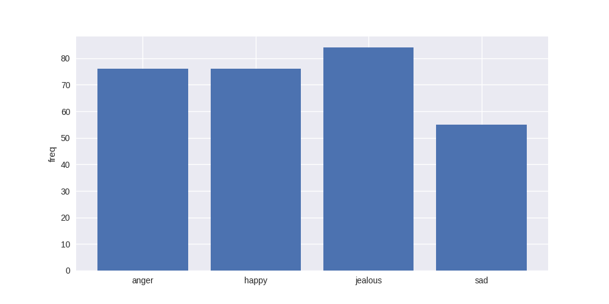

# Emotion-Music
MCMC hackathon 2017

We will use convolutional neural network to detect emotion using any live webcam, but this hackathon.

We got 2 separate Convolutional Neural Network, first model is to detect who is the person, second model is to detect emotion from the face.

We are using Tensorflow Library for dynamic graph machine learning.
```bash
sudo pip install scipy numpy matplotlib tensorflow
```


## Old dataset, we not used it anymore

```text
anger: 76
happy: 76
jealous: 84
sad: 55
```

```text
Husein: 157
Julius: 181
Ugen: 149
unknown: 192

```

## training session

Pretty much overfitted, 60% achieve during validation

fine enough for hackathon!

## model architecture


0.5. Unzip *.zip from data/, dataperson/ in the same directories. You can add new pictures or remove some.
1. You able to capture new face using capture.py
2. You need to train person detection using train_person.py
3. You able to train the emotion using train_emotion.py
4. to test on live any camera, use live.py
