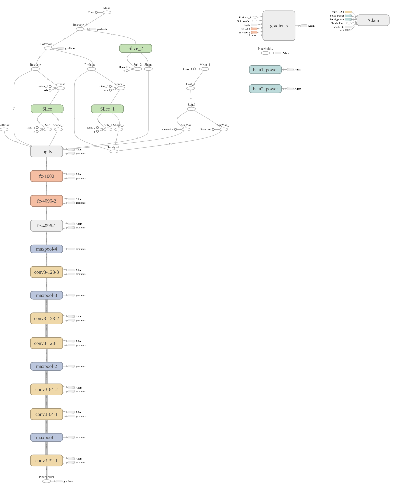

# Emotion-Music
MCMC hackathon 2017

We will use convolutional neural network to detect emotion using any live webcam, but this hackathon, we just demo on external webcam. [TRAIN USING THIS DATASET](http://cswww.essex.ac.uk/mv/allfaces/faces96.html)


```text
anger: 336
happy: 411
jealous: 416
pain: 336
sad: 375
```

## model architecture

